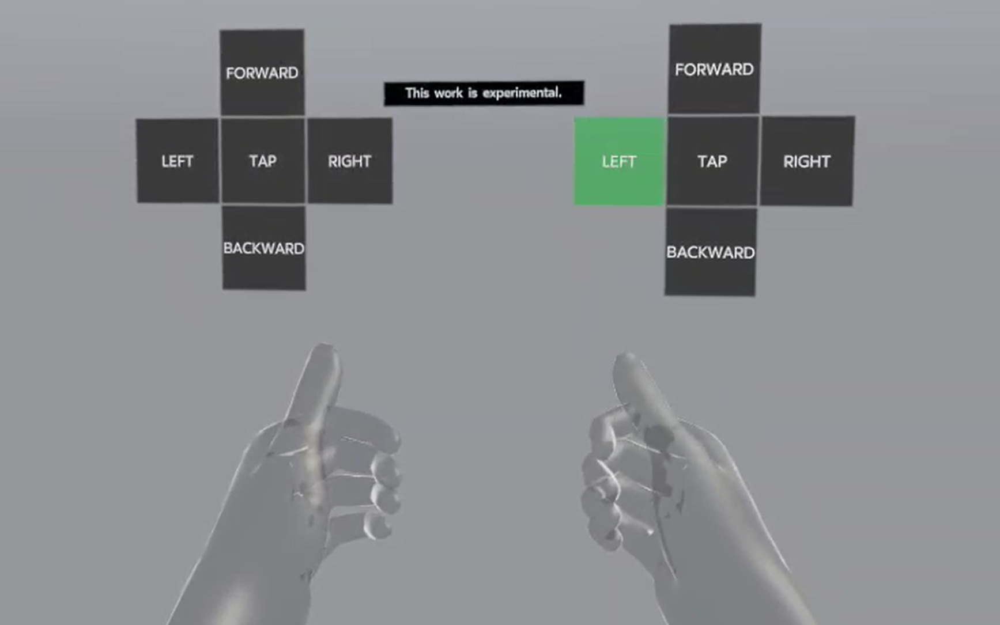
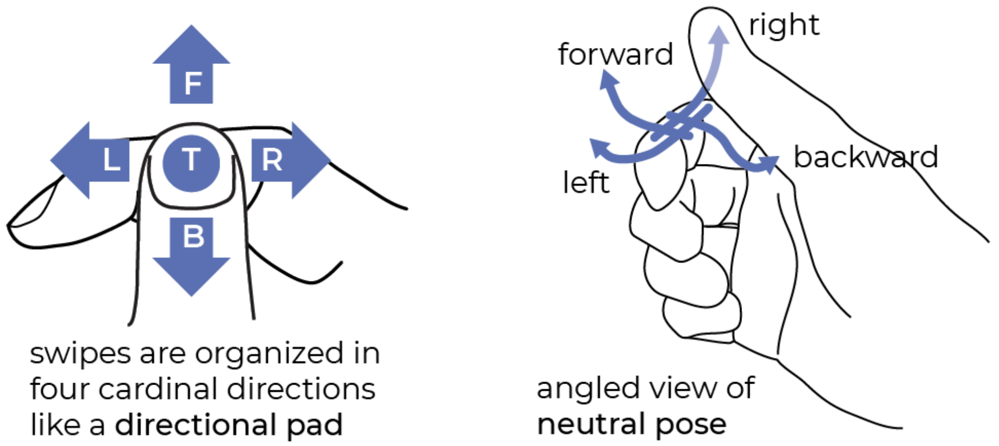

# STMG: A Machine Learning Microgesture Recognition System for Supporting Thumb-Based VR/AR Input

Thank you for your interest in our [paper](https://dl.acm.org/doi/10.1145/3613904.3642702) on skeletal tracking microgestures (STMG). We have a simple demo available to show microgestures on Meta Quest 2, Meta Quest Pro, and Meta Quest 3. Please understand that this is currently experimental work.

## Installation

1. Enable hand tracking in your headset's Settings:\
Settings -> Movement tracking -> Hand Tracking -> Hand and body tracking -> Enable\
https://www.meta.com/help/quest/articles/headsets-and-accessories/controllers-and-hand-tracking/hand-tracking/

2. Put your headset in developer mode:\
https://developer.oculus.com/documentation/native/android/mobile-device-setup/

3. Download the [demo](demo/stmg_demo.apk) application from this repo and to install it you’ll need adb https://developer.android.com/tools/adb and then run:\
`adb install stmg_demo.apk`

4. To launch the app you can find the app under Applications -> Unknown Sources -> Microgestures Sample\
Or to launch the app from command line:\
`adb shell am start -n com.realitylabs.stmg/com.realitylabs.stmg.MainActivity`

5. To uninstall run:\
`adb uninstall com.realitylabs.stmg`

Please note that the model you are trying is not exactly the same as the one presented in the paper. Due to technical constraints and the ongoing evolution of hand tracking, we do not currently offer the exact model from the paper. Relatedly, we are only able to offer the thumb swipe and thumb tap model outputs at this time, but not pinch.

## Gesture Tips

- Try making directional swipes of at least 2 cm.
- Keep your fingers slightly opened/uncurled like holding an umbrella.
- Lift your thumb at the end of a swipe.
- For forward and backward swipes, you may curl/uncurl your index finger in the opposing direction.
- At the end of a backward swipe, your thumb may dip slightly into your palm before lifting.
- If you swipe too slow, e.g., very slowly sliding your thumb across the index finger, the model may not pick up or consider the motion to be a true swipe.
- If you swipe too fast in a jerky or overly aggressive motion, the model may also not pick up the gesture.

## License
The STMG demo is licensed under the [MIT License](LICENSE).
